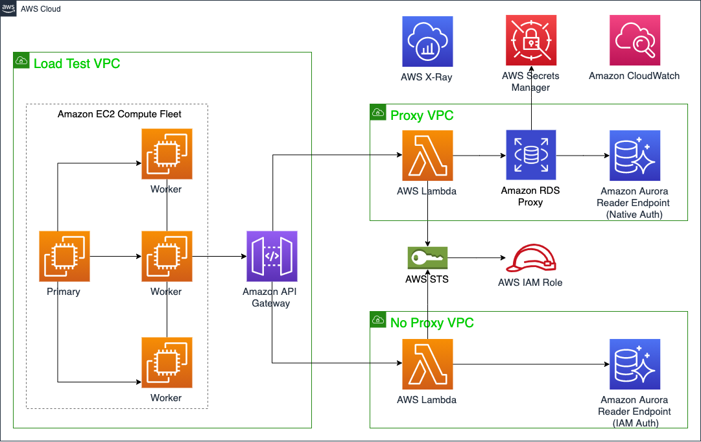

## Amazon RDS Proxy MySQL Multi-Tenant Load Test

#### Database migration from a simulated on-premises MS SQL Server to an Amazon RDS instance in AWS Cloud

An AWS CloudFormation template that builds and load tests two multi-tenant Amazon Aurora MySQL clusters, one with and one without Amazon RDS Proxy. This is repository that is referenced in the accompanying blog post: Build and load test a multi-tenant SaaS database proxy solution with Amazon RDS Proxy

An overview of the architecture is below:

### Usage

#### Prerequisites

To deploy the solution, you will require an AWS account. If you don’t already have an AWS account,
create one at <https://aws.amazon.com> by following the on-screen instructions.
Your access to the AWS account must have IAM permissions to launch AWS CloudFormation templates that create IAM roles.

#### Deployment

The application is deployed as an [AWS CloudFormation](https://aws.amazon.com/cloudformation) template.

> **Note**
You are responsible for the cost of the AWS services used while running this sample deployment. There is no additional
>cost for using this sample. For full details, see the pricing pages for each AWS service you will be using in this sample. Prices are subject to change.

1. Deploy the latest CloudFormation template by following the link below for your preferred AWS region:

|Region|Launch Template|
|------|---------------|
|**US East (N. Virginia)** (us-east-1) | |
|**US East (Ohio)** (us-east-2) | |
|**US West (N. California)** (us-west-1) | |
|**US West (Oregon)** (us-west-2) | |
|**Asia Pacific (Mumbai)** (ap-south-1) | |
|**Asia Pacific (Seoul)** (ap-northeast-2) | |
|**Asia Pacific (Singapore)** (ap-southeast-1) | |
|**Asia Pacific (Sydney)** (ap-southeast-2) | |
|**Asia Pacific (Tokyo)** (ap-northeast-1) | |
|**Canada (Central)** (ca-central-1) | |
|**Europe (Frankfurt)** (eu-central-1) | |
|**Europe (Ireland)** (eu-west-1) | |
|**Europe (London)** (eu-west-2) | |

2. If prompted, login using your AWS account credentials.
1. You should see a screen titled "*Create Stack*" at the "*Specify template*" step. The fields specifying the CloudFormation
template are pre-populated. Click the *Next* button at the bottom of the page.
1. On the "*Specify stack details*" screen you may customize the following parameters of the CloudFormation stack:

|Parameter label|Default|Description|
|---------------|-------|-----------|
|Availability Zones|Requires input|The list of Availability Zones to use for the subnets in the VPCs. *Use two AZs*.|
|RDS Instance Class|db.r5.large|Instance class of RDS instance.|
|Performance Insights Retention Period|7|Number of days, to retain Amazon RDS Performance Insights data for both clusters. Values are 7 to 731 (2 years).|
|Lambda Runtime Environment|Node.js|The runtime for the AWS Lambda Function that access the database data.|
|Environment|DEV|The environment to tag your infrastructure. Should be either DEV, TEST, or PROD.|
|Create Load Test Stack|true|Whether to also deploy VPCs B and C in the above diagram, that load tests the RDS Proxy architecture with a No Proxy alternative.|
|Latest Amazon Linux AMI|/aws/service/ami-amazon-linux-latest/amzn2-ami-hvm-x86_64-gp2|Latest Amazon Linux AMI, using Systems Manager Parameter Store
|Locust instance type|c5.large|The EC2 instance type for Locust load testing.|
|Locust App Version|1.2.3|The version of Locust installed on the EC2 instances.|
|Locust Worker Instances|2|Number of worker nodes, minimum is 2.|
|API Gateway Endpoint Type|PRIVATE|Set to either EDGE, REGIONAL, or PRIVATE.|

   When completed, click *Next*
1. [Configure stack options](https://docs.aws.amazon.com/AWSCloudFormation/latest/UserGuide/cfn-console-add-tags.html) if desired, then click *Next*.
1. On the review you screen, you must check the boxes for:
   * "*I acknowledge that AWS CloudFormation might create IAM resources*"
   * "*I acknowledge that AWS CloudFormation might create IAM resources with custom names*"
   * "*I acknowledge that AWS CloudFormation might require the following capability: CAPABILITY_AUTO_EXPAND*"

   These are required to allow CloudFormation to create a Role to allow access to resources needed by the stack and name the resources in a dynamic way.
1. Click *Create Stack*
1. Wait for the CloudFormation stack to launch. Completion is indicated when the "Stack status" is "*CREATE_COMPLETE*".
   * You can monitor the stack creation progress in the "Events" tab.
1. Note the *EC2SQLServerEip* and *RDSSQLEndpoint* displayed in the *Outputs* tab of the main stack. This can be used to access the EC2 host and RDS instance.

## Local Development
See [Local Development](docs/LOCAL_DEVELOPMENT.md) guide to get a copy of the project up and running on your local machine for development and testing purposes.

### Clean up

To remove the stack:

1. Open the AWS CloudFormation Console
1. Click the *aws-multitenant-rds-proxy* project, right-click and select "*Delete Stack*"
1. Your stack will take some time to be deleted. You can track its progress in the "Events" tab.
1. When it is done, the status will change from "DELETE_IN_PROGRESS" to "DELETE_COMPLETE". It will then disappear from the list.

## Contributing

Contributions are more than welcome. Please read the [code of conduct](CODE_OF_CONDUCT.md) and the [contributing guidelines](CONTRIBUTING.md).

## License

This library is licensed under the MIT-0 License. See the LICENSE file.
